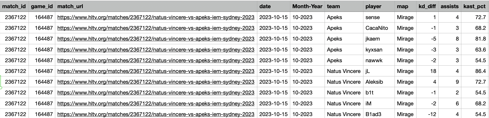

This code requires a specific CSV to produce the needed gaussian and poisson distributions parquet. However, since the CSV is nearly 100MB and the parquet is over 100MB, I will not be uploading those datasets here. Please reach out to me if you want them. They are large because I built a webscraper to get all of the CS2 professional match data that I could: it is well over 500,000 rows by now.

cs_analysis_functions contains methods for pulling raw stats from the CSV, transform them into a parquet with the necessary statistics to create the theoretical distributions, and compare functions for plotting actual vs. theoretical.

Raw_Distributions.ipynb is a jupyter notebook for creating the parquet. The code runs on order O(players x maps), so relatively quickly; I multiprocess over # cores - 2 to finish the process in <5 seconds (at least on my machine). DistributionApp.py uses streamlit to overlay actual vs theoretical on a plotly graph. Since I'm on macOS, I run it through Distributions.command.

Understanding these distributions is key, because it allows for random sampling and Monte Carlo simulation to evaluate and predict player and team performances across a tournament.

/Distribution Confirmation/ : shows that kd / kast follow a gaussian distribution quite well, according to the Shapiro tests. Also shown is that assists follows a negative binomial (and in some special cases poisson) distribution quite well from goodness of fit tests. Test code and random sampling methodology is found in Distribution_Check.py.

/Team Data/ : Shows images of individual player performance graphs for kd / kast / assists overlayed with theoretical distribution. As an example, here is NiKo's distributions:

One thing that I've never seen anyone really do before was compare the Round_Win_% against the Rank_Diff of two teams meeting each other. This is contained within /Round Win % & Rank Diff/. What you find is an absolutely beautiful distribution regardless of map:

